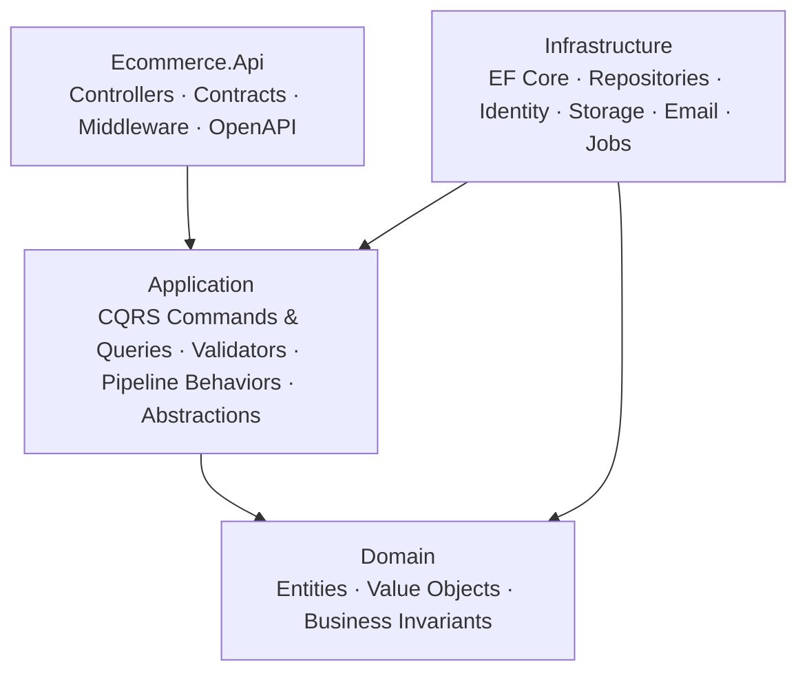

# ElectroShop — E-Commerce Engine & Enterprise Backend Architecture

[](https://dotnet.microsoft.com/)
[](https://blog.cleancoder.com/uncle-bob/2012/08/13/the-clean-architecture.html)
[](https://github.com/jbogard/MediatR)
[](#testing)
[](#roadmap)
[](./LICENSE.md)

ElectroShop is a modular e-commerce backend built with C# and .NET 10. It implements the full retail flow — catalog, cart, checkout, orders, cash-on-delivery payments, inventory, procurement, reviews, and newsletter — using **Clean Architecture**, **Domain-Driven Design**, **CQRS with MediatR**, and **Vertical Slice Architecture**.

> [!NOTE]
> This repository is public for portfolio evaluation, code review, and educational purposes only. See [License](#license).

---

## Table of Contents

- [Feature Overview](#feature-overview)
- [Architecture](#architecture)
- [Tech Stack](#tech-stack)
- [Project Structure](#project-structure)
- [Domain Model](#domain-model)
- [Getting Started](#getting-started)
- [Authentication & Authorization](#authentication--authorization)
- [API Surface](#api-surface)
- [Testing](#testing)
- [Roadmap](#roadmap)
- [License](#license)

## Feature Overview

| Area | Capabilities |
|---|---|
| **Identity** | Registration with email confirmation, JWT login, refresh-token rotation and revocation, password reset, lockout after repeated failures, web sessions with HttpOnly refresh-token cookies + antiforgery, role-based authorization |
| **Catalog** | Bilingual (EN/AR) categories, brands, and products with SKUs, dynamic attributes (RAM, color, …), image galleries with automatic resize to WebP, and configurable discounts |
| **Cart & Checkout** | One persistent cart per customer, stock-validated quantities, live checkout summary, promo-code evaluation |
| **Orders** | Checkout with purchase-time name/SKU/price snapshots, promo codes, shipping fee, atomic stock decrement with overselling protection, customer cancellation that restores stock, full staff-driven state machine |
| **Payments** | Cash on delivery: payment recorded per order, idempotent mark-as-paid on cash collection, refunds for delivered orders |
| **Inventory** | Stock in/out/adjust with an auditable transaction log (before/after quantities), reorder levels and low-stock flags |
| **Procurement** | Suppliers, purchase orders (draft → approval → partial/full receipt → completion), goods receipts that feed stock into inventory through auditable transactions |
| **Reviews** | Purchase-gated reviews (one per customer per product), owner editing, support-agent moderation, public listing |
| **Newsletter** | Public subscribe/unsubscribe with duplicate prevention, subscriber listing for administrators |

## Architecture

The solution follows **Clean Architecture**: dependencies point inward, and the Domain layer has exactly one deliberate framework dependency (`Microsoft.AspNetCore.Identity.EntityFrameworkCore` for the identity base classes).



On top of the layers, the Application and API code is organized by **business capability** (vertical slices). Each slice owns its command/query, handler, validator, and DTOs:

```text
HTTP Request
    → Controller (thin: maps to command, sends via MediatR)
    → FluentValidation (pipeline behavior)
    → Command / Query Handler
        → Domain entities and business rules
        → Repository / storage / job abstractions
    → UnitOfWork.Save → HTTP Response
```

### Pipeline Behaviors

Every request passes through MediatR pipeline behaviors:

| Behavior | Responsibility |
|---|---|
| `LoggingBehavior` | Logs every request; warns on slow requests (≥ 500 ms) |
| `ValidationBehavior` | Runs all FluentValidation validators, fails with 400 |
| `CachingBehavior` | Serves queries implementing `ICacheableQuery` from HybridCache (Redis + L1) |
| `CacheInvalidationBehavior` | Evicts keys/tags declared by commands implementing `ICacheInvalidatingCommand` |

### Error Model

Exceptions map to consistent HTTP responses via a global exception handler:

| Exception | HTTP |
|---|---|
| `ValidationException` | 400 with field errors |
| `DomainException` | 400 |
| `NotFoundException` | 404 |
| `UnauthorizedException` / `UnauthorizedAccessException` | 401 |
| `ForbiddenException` | 403 |
| `ConflictException` / `DbUpdateConcurrencyException` | 409 |
| anything else | 500 (generic body, logged as error) |

> [!NOTE]
> Route parameters intentionally use plain `{id}` **without** the `{id:guid}` constraint: a malformed identifier fails model binding and returns **400** instead of a misleading 404 "endpoint not found".

## Tech Stack

| Concern | Technology |
|---|---|
| Runtime | .NET 10, ASP.NET Core controllers |
| Persistence | EF Core 10 (SQL Server), repositories + UnitOfWork |
| Identity | ASP.NET Core Identity (GUID keys) + JWT bearer |
| Caching | HybridCache (L1 in-memory + Redis L2) with key/tag invalidation |
| Background jobs | Hangfire (SQL Server storage, priority queues) |
| Email | MailKit + RazorLight embedded Razor templates |
| Media | SixLabors ImageSharp (resize/WebP) + Azure Blob Storage |
| API docs | OpenAPI + Scalar UI |
| Logging | Serilog (console) + request logging |
| Tests | xUnit, Moq, FluentAssertions (~400 tests across 3 projects) |
| CI | GitHub Actions: restore, vulnerability check, Release build with warnings-as-errors, tests |

## Project Structure

```text
Ecommerce.Api/
├── Domain/                        # Entities, value objects, enums, invariants (no external deps*)
├── Application/                   # Use cases: Features/<Area>/{Commands,Queries}, abstractions, behaviors
│   ├── Abstractions/              # IRepository, IUnitOfWork, IStorageService, ICurrentUserService, …
│   ├── Behaviors/                 # MediatR pipeline behaviors
│   ├── Common/                    # Pagination, filters, checkout calculator, validation helpers
│   └── Features/                  # Account, Brands, Categories, Products, Discounts, Carts,
│                                  # Orders, Payments, PromoCodes, Inventories, Procurement,
│                                  # Reviews, Newsletter
├── Infrastructure/                # EF Core configurations + migrations, repositories, services
│   ├── Persistenace/              # AppDbContext, configurations, migrations (sic — folder name)
│   ├── Repositories/              # Generic Repository<T>, ProductRepository, UnitOfWork
│   └── Services/                  # JWT, MailKit email, RazorLight, ImageSharp, Azure blobs, Hangfire
├── Ecommerce.Api/                 # Presentation: Controllers (public + Admin), Contracts, middleware
├── Domain.Test/                   # Domain invariants and state machines
├── Application.Test/              # Handler behavior tests (xUnit + Moq + FluentAssertions)
└── Infrastructure.Test/           # Repositories, JWT, email rendering, image service (EF InMemory)
```

\* The single allowed Domain dependency is the Identity package for `AppUser : IdentityUser<Guid>` and `AppRole : IdentityRole<Guid>`.

## Domain Model

| Aggregate area | Aggregates / entities |
|---|---|
| Identity | `AppUser`, `AppRole`, `RefreshToken` |
| Catalog | `Category`, `Brand`, `Product` (+ `ProductImage`, `ProductAttribute`), `Discount` |
| Commerce | `Cart` / `CartItem`, `Order` / `OrderItem` (snapshot lines), `PromoCode` |
| Payments | `Payment`, `PaymentAttempt` |
| Operations | `Inventory` / `InventoryTransaction`, `Supplier`, `PurchaseOrder`, `GoodsReceipt` |
| Engagement | `Review`, `NewsletterSubscriber` |

The full relational model is documented in [`ecommerce_erd.mmd`](./ecommerce_erd.mmd) (Mermaid ERD).

Key domain decisions:

- **Order lines are immutable snapshots.** Product name (EN/AR), SKU, unit price, and discount amount are captured at purchase time; orders never change when the catalog changes.
- **Checkout prevents overselling with optimistic concurrency.** Stock is decremented inside the unit of work, guarded by the `Inventory` rowversion token; a concurrent checkout gets a 409. Cancelling an order restores stock and records the restoring transaction.
- **Money is `decimal(18,2)`, discount values `decimal(18,4)`.** Concurrency tokens (rowversion) protect `Product`, `Inventory`, `Order`-adjacent stock, `PromoCode`, `Payment`, and `PurchaseOrder`.

## Getting Started

### Prerequisites

- [.NET 10 SDK](https://dotnet.microsoft.com/download)
- SQL Server (local or container) — connection string `DefaultConnection`
- Redis — connection string `Redis` (used by HybridCache)
- An SMTP account (optional for local runs; email sending is queued via Hangfire)

### Setup

1. Clone the repository:

   ```bash
   git clone https://github.com/Darkness00132/Ecommerce.Api.git
   cd Ecommerce.Api
   ```

2. Configure `Ecommerce.Api/appsettings.Development.json` (or user secrets):

   | Setting | Purpose |
   |---|---|
   | `ConnectionStrings:DefaultConnection` | SQL Server database |
   | `ConnectionStrings:Redis` | Redis for the distributed cache |
   | `Jwt` | Issuer, audience, signing key, token lifetimes |
   | `Email` | SMTP host/credentials and from address |
   | `AzureStorage` | Blob container connection string |
   | `Shipping:Fee` | Flat shipping fee applied at checkout |
   | `FrontendUrl` | Base URL used in confirmation/reset email links |

3. Apply the database migrations:

   ```bash
   dotnet ef database update --project Infrastructure --startup-project Ecommerce.Api
   ```

4. Build and run:

   ```bash
   dotnet build
   dotnet run --project Ecommerce.Api
   ```

5. Open the root URL (`https://localhost:<port>/`) for the **Scalar** API reference. Use its **Authorize** control with `Bearer <access-token>` for protected endpoints.

> [!IMPORTANT]
> On startup the API seeds the roles and a SuperAdmin account (`owner@ecommerce.com` / `Admin#123`). This exists for local development only — change or remove the seeding block in `Program.cs` before any real deployment.

Useful local URLs:

| Tool | URL |
|---|---|
| Scalar API reference | `/` |
| Health check | `/health` |
| Hangfire dashboard | `/hangfire` |

> [!WARNING]
> The Hangfire dashboard currently has no authentication configured. Restrict it before deploying.

## Authentication & Authorization

Two client styles are supported:

- **Native / mobile:** `POST /api/account/login` returns an access token + refresh token pair. Refresh with `POST /api/account/refresh`; revoke with `POST /api/account/logout`.
- **Web:** `GET /api/account/csrf-web` issues an antiforgery token; `POST /api/account/login-web` (with the `X-XSRF-TOKEN` header) returns the access token and stores the refresh token in a secure `HttpOnly` cookie. Refresh and revoke happen through `refresh-web` / `revoke-web`.

Authorization is role-based. Roles are seeded at startup and combined into policy-like constants:

| Constant | Roles included | Guards |
|---|---|---|
| `CatalogAdministrators` | SuperAdmin, Admin, CatalogManager | Brands, categories, products, discounts |
| `InventoryAdministrators` | SuperAdmin, Admin, InventoryManager | Inventories |
| `ProcurementAdministrators` | SuperAdmin, Admin, ProcurementManager | Suppliers, purchase orders, goods receipts |
| `SalesAdministrators` | SuperAdmin, Admin, SalesManager | Orders, payments, promo codes |
| `SupportUsers` | SuperAdmin, Admin, SupportAgent | Review moderation |
| `Administrators` | SuperAdmin, Admin | Newsletter subscribers |

New registrations receive the `Customer` role automatically. Failed logins count toward lockout (5 attempts → 30 minutes).

## API Surface

The Scalar UI is the source of truth. High-level groups:

<details>
<summary>Endpoint groups (click to expand)</summary>

| Group | Route | Access |
|---|---|---|
| Account | `/api/account/*` | Anonymous + authenticated |
| Categories (public) | `/api/categories` | Anonymous |
| Brands (public) | `/api/brands` | Anonymous |
| Products (public storefront, active only) | `/api/products` | Anonymous |
| Cart + checkout summary | `/api/cart` | Authenticated |
| Orders (place, view, cancel) | `/api/orders` | Authenticated |
| Reviews (list, create, update) | `/api/reviews` | Anonymous / Authenticated |
| Newsletter (subscribe, unsubscribe) | `/api/newsletter` | Anonymous |
| Category / Brand / Product / Discount management | `/api/admin/*` | `CatalogAdministrators` |
| Inventory management | `/api/admin/inventories` | `InventoryAdministrators` |
| Suppliers / Purchase orders / Goods receipts | `/api/admin/*` | `ProcurementAdministrators` |
| Orders / Payments / Promo codes | `/api/admin/*` | `SalesAdministrators` |
| Review moderation | `DELETE /api/reviews/{id}` | `SupportUsers` |
| Newsletter subscribers | `/api/newsletter/subscribers` | `Administrators` |

</details>

Conventions worth knowing as a consumer:

- Identifiers are GUIDs; malformed identifiers return **400**.
- Missing resources return **404**; business-rule violations (empty cart, insufficient stock, duplicate names/codes) return **409**.
- List endpoints are paginated: `?pageNumber=1&pageSize=20` (max 100), returning `PagedResult<T>`.

## Testing

```bash
dotnet test
```

Tests follow **behavior-driven unit testing**: test classes and methods are named as business rules (for example `The_Order_Lines_Carry_The_Product_Name_And_SKU_Snapshots`), exercise only the public `Handle` of a use case, and assert observable outcomes through the repository/service abstractions — never implementation details. This keeps the suite resistant to refactoring.

| Project | Covers |
|---|---|
| `Domain.Test` | Entity invariants, state machines, value objects |
| `Application.Test` | Handlers per feature: happy paths, failure paths, compensation logic |
| `Infrastructure.Test` | Repositories (EF InMemory), JWT generation, email rendering, image resizing |

CI (`.github/workflows/ci.yml`) runs restore, `dotnet list package --vulnerable`, a Release build with warnings treated as errors, and the full test suite on every push/PR to `master`.

## Roadmap

- [ ] Card/wallet payments behind an `IPaymentGateway` application contract (COD only today)
- [ ] Two-factor authentication (TOTP)
- [ ] Shipping fee calculation by address/weight instead of a flat setting
- [ ] Azure deployment: Azure SQL, Azure Blob Storage with SAS, CI/CD to Azure App Service
- [ ] Low-stock alerting via Hangfire recurring jobs

## License

This repository is licensed under the [PolyForm Noncommercial License 1.0.0](./LICENSE.md): you may study and adapt the code non-commercially, but commercial or production use by third parties is prohibited.

For commercial licensing or usage inquiries, contact **mustafamohamedanwar1@gmail.com**.
